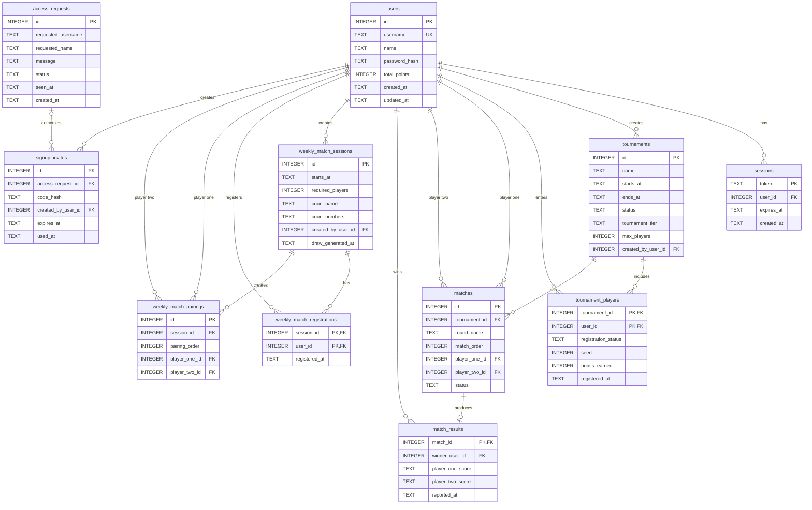

# Rally entity relationship diagram

```mermaid
erDiagram
  users {
    INTEGER id PK
    TEXT username UK
    TEXT name
    TEXT password_hash
    INTEGER total_points
    TEXT created_at
    TEXT updated_at
  }

  sessions {
    TEXT token PK
    INTEGER user_id FK
    TEXT expires_at
    TEXT created_at
  }

  tournaments {
    INTEGER id PK
    TEXT name
    TEXT starts_at
    TEXT ends_at
    TEXT status
    TEXT tournament_tier
    INTEGER max_players
    INTEGER created_by_user_id FK
  }

  tournament_players {
    INTEGER tournament_id PK, FK
    INTEGER user_id PK, FK
    TEXT registration_status
    INTEGER seed
    INTEGER points_earned
    TEXT registered_at
  }

  matches {
    INTEGER id PK
    INTEGER tournament_id FK
    TEXT round_name
    INTEGER match_order
    INTEGER player_one_id FK
    INTEGER player_two_id FK
    TEXT status
  }

  match_results {
    INTEGER match_id PK, FK
    INTEGER winner_user_id FK
    TEXT player_one_score
    TEXT player_two_score
    TEXT reported_at
  }

  weekly_match_sessions {
    INTEGER id PK
    TEXT starts_at
    INTEGER required_players
    TEXT court_name
    TEXT court_numbers
    INTEGER created_by_user_id FK
    TEXT draw_generated_at
  }

  weekly_match_registrations {
    INTEGER session_id PK, FK
    INTEGER user_id PK, FK
    TEXT registered_at
  }

  weekly_match_pairings {
    INTEGER id PK
    INTEGER session_id FK
    INTEGER pairing_order
    INTEGER player_one_id FK
    INTEGER player_two_id FK
  }

  access_requests {
    INTEGER id PK
    TEXT requested_username
    TEXT requested_name
    TEXT message
    TEXT status
    TEXT seen_at
    TEXT created_at
  }

  signup_invites {
    INTEGER id PK
    INTEGER access_request_id FK
    TEXT code_hash
    INTEGER created_by_user_id FK
    TEXT expires_at
    TEXT used_at
  }

  users ||--o{ sessions : has
  users ||--o{ tournaments : creates
  users ||--o{ tournament_players : enters
  tournaments ||--o{ tournament_players : includes
  tournaments ||--o{ matches : has
  users ||--o{ matches : "player one"
  users ||--o{ matches : "player two"
  matches ||--o| match_results : produces
  users ||--o{ match_results : wins
  users ||--o{ weekly_match_sessions : creates
  weekly_match_sessions ||--o{ weekly_match_registrations : has
  users ||--o{ weekly_match_registrations : registers
  weekly_match_sessions ||--o{ weekly_match_pairings : creates
  users ||--o{ weekly_match_pairings : "player one"
  users ||--o{ weekly_match_pairings : "player two"
  access_requests o|--o{ signup_invites : authorizes
  users ||--o{ signup_invites : creates
```
